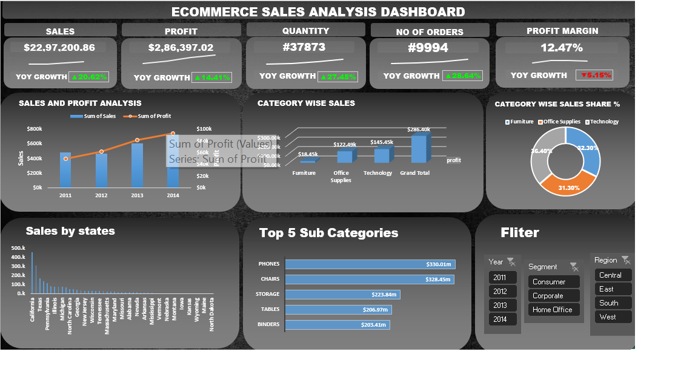

  # 📊 E-commerce Sales Analysis Dashboard

An interactive Excel dashboard built to analyze e-commerce sales and profit trends across product categories, sub-categories, and U.S. states (2011–2014).

---

## 🛠️ Tools & Techniques Used

- **Microsoft Excel**
- **Pivot Tables & Pivot Charts** — for yearly, category, sub-category, and state-level aggregation
- **Combo Chart** (Bar + Line) — Sales vs Profit trend over the years
- **Doughnut, 3D Bar & Line Charts** — category and regional breakdown
- **Sparklines** — KPI trend indicators
- **Slicers** — interactive filtering across charts
- **Formulas** — `SUM`, YoY % Growth calculations, Profit Margin calculation

---

## 📈 Key Insights

- **Total Sales: $2.3M+ | Total Profit: $286.4K** across 2011–2014, with an overall profit margin of ~12.5%
- **2014 was the best-performing year** — highest sales at $733,947, with YoY growth (vs 2013) of **+20.62% in Sales**, **+14.41% in Profit**, and **+28.64% in Orders**
- **Technology is the most profitable category** ($145.5K profit, 36% of total sales), while **Furniture generated the lowest profit** ($18.5K) despite a 32% sales share — indicating heavy discounting is eating into Furniture margins
- **Profit Margin dropped -5.15% YoY in 2014** — sales and profit both grew, but discounting pressure slightly weakened overall margin health
- **Geographic concentration is high** — California, New York, and Texas together account for ~41% of total sales
- **Phones and Chairs are the top-selling sub-categories** by revenue

---

## 📁 Files

- `Ecommerce_Sales_Analysis_DASHBOARD.xlsx` — full workbook with raw data, pivot tables, and dashboard

---

## 🔍 Dataset

Sample e-commerce transactional dataset (Order ID, Customer, Category, Sub-Category, Sales, Profit, Quantity, Discount, State, Region, etc.) covering 2011–2014.

---

## 👩‍💻 Author

**Anushree**
